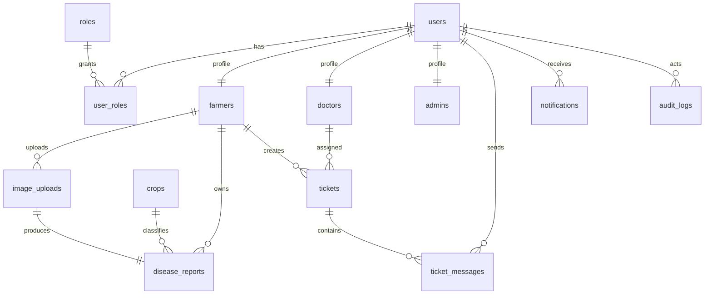
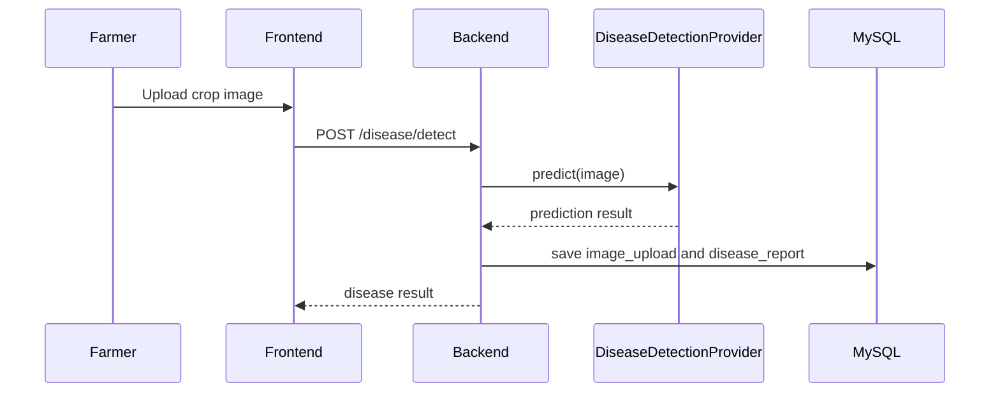

# Diagrams

## ER Diagram

```mermaid
erDiagram
  users ||--o{ user_roles : has
  roles ||--o{ user_roles : grants
  users ||--|| farmers : profile
  users ||--|| doctors : profile
  users ||--|| admins : profile
  farmers ||--o{ image_uploads : uploads
  farmers ||--o{ disease_reports : owns
  crops ||--o{ disease_reports : classifies
  image_uploads ||--|| disease_reports : produces
  farmers ||--o{ tickets : creates
  doctors ||--o{ tickets : assigned
  tickets ||--o{ ticket_messages : contains
  users ||--o{ ticket_messages : sends
  users ||--o{ notifications : receives
  users ||--o{ audit_logs : acts
```

## Detection Sequence

```mermaid
sequenceDiagram
  Farmer->>Frontend: Upload crop image
  Frontend->>Backend: POST /disease/detect
  Backend->>DiseaseDetectionProvider: predict(image)
  DiseaseDetectionProvider-->>Backend: prediction result
  Backend->>MySQL: save image_upload and disease_report
  Backend-->>Frontend: disease result
```
