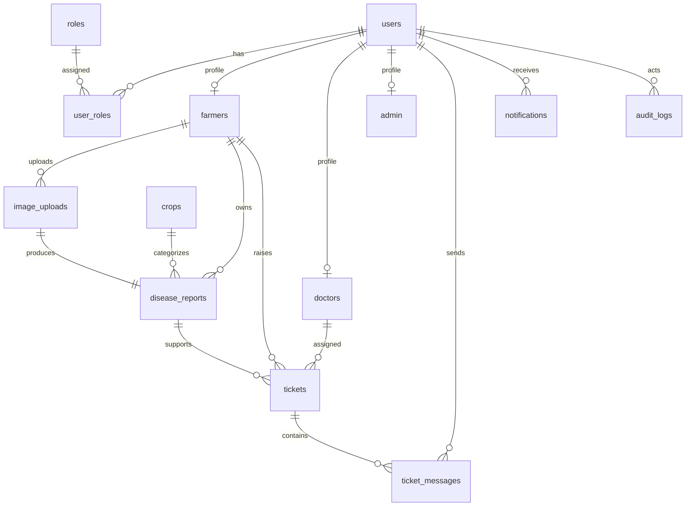
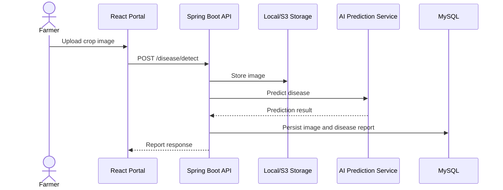
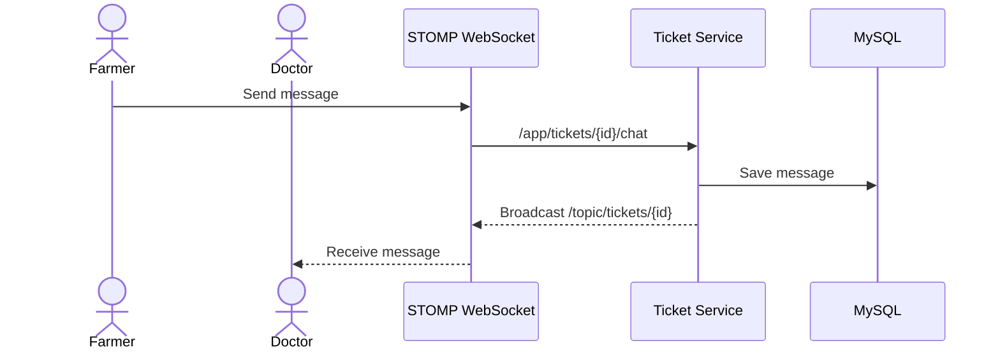
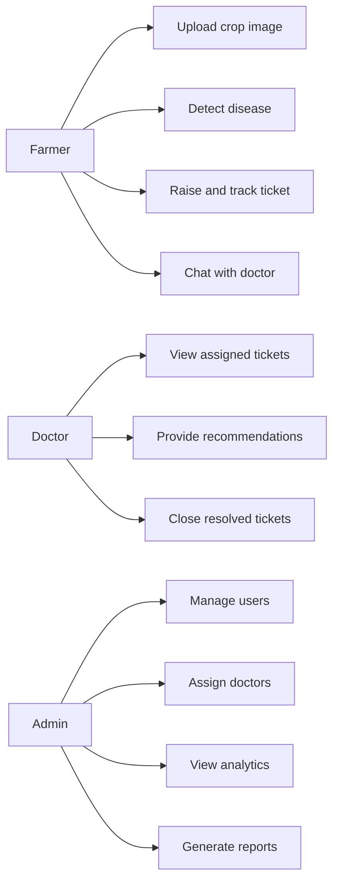

# Diagrams

## ER Diagram

```mermaid
erDiagram
  users ||--o{ user_roles : has
  roles ||--o{ user_roles : assigned
  users ||--o| farmers : profile
  users ||--o| doctors : profile
  users ||--o| admin : profile
  farmers ||--o{ image_uploads : uploads
  farmers ||--o{ disease_reports : owns
  crops ||--o{ disease_reports : categorizes
  image_uploads ||--|| disease_reports : produces
  farmers ||--o{ tickets : raises
  doctors ||--o{ tickets : assigned
  disease_reports ||--o{ tickets : supports
  tickets ||--o{ ticket_messages : contains
  users ||--o{ ticket_messages : sends
  users ||--o{ notifications : receives
  users ||--o{ audit_logs : acts
```

## Disease Detection Sequence

```mermaid
sequenceDiagram
  actor Farmer
  participant UI as React Portal
  participant API as Spring Boot API
  participant Storage as Local/S3 Storage
  participant AI as AI Prediction Service
  participant DB as MySQL
  Farmer->>UI: Upload crop image
  UI->>API: POST /disease/detect
  API->>Storage: Store image
  API->>AI: Predict disease
  AI-->>API: Prediction result
  API->>DB: Persist image and disease report
  API-->>UI: Report response
```

## Ticket Chat Sequence

```mermaid
sequenceDiagram
  actor Farmer
  actor Doctor
  participant WS as STOMP WebSocket
  participant API as Ticket Service
  participant DB as MySQL
  Farmer->>WS: Send message
  WS->>API: /app/tickets/{id}/chat
  API->>DB: Save message
  API-->>WS: Broadcast /topic/tickets/{id}
  WS-->>Doctor: Receive message
```

## Use Case Diagram

```mermaid
flowchart LR
  Farmer["Farmer"] --> Upload["Upload crop image"]
  Farmer --> Detect["Detect disease"]
  Farmer --> Ticket["Raise and track ticket"]
  Farmer --> Chat["Chat with doctor"]
  Doctor["Doctor"] --> Assigned["View assigned tickets"]
  Doctor --> Recommend["Provide recommendations"]
  Doctor --> Close["Close resolved tickets"]
  Admin["Admin"] --> Users["Manage users"]
  Admin --> Assign["Assign doctors"]
  Admin --> Analytics["View analytics"]
  Admin --> Reports["Generate reports"]
```
